# Linenfog Café

A personal project showcasing a modern and sleek online storefront for a fictitious cafe.

### https://matthxu.github.io/cafe/

## Overview

Optimised for mobile and wider screens alike, the website aims to replicate the experience of visting a physical store and invite customers to explore and learn more about their local cafe. The user-friendly home interface is divided into multiple seamless segments - all of which can be accessed within a single page for ease of use. These segments include an 'about' portion, menu and coffee beans section, an interactive map in addition to a contact form.

The demo and screenshots of the website can be accessed directly below.

## Demo

#### https://matthxu.github.io/cafe/

## Color Reference

| Color      | Hex                                                              |
| ---------- | ---------------------------------------------------------------- |
| Background |  #f5ebe0 |
| Primary    |  #564a3b |
| Secondary  |  #a9a9a9 |
| Accent     |  #f8f8f8 |

### Fonts

-   #### [Univers](https://font.download/font/univers)

-   #### [Hedvig Letters Serif](https://fonts.google.com/specimen/Hedvig+Letters+Serif)

## Screenshots

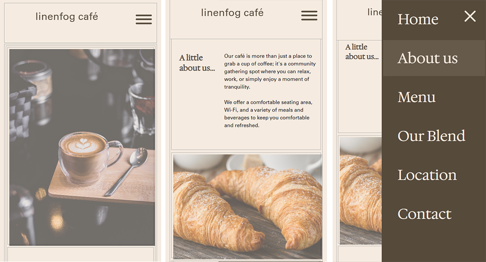
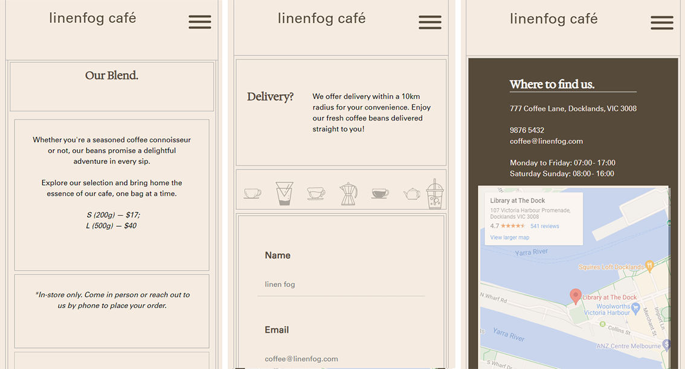

#### Regular Interface

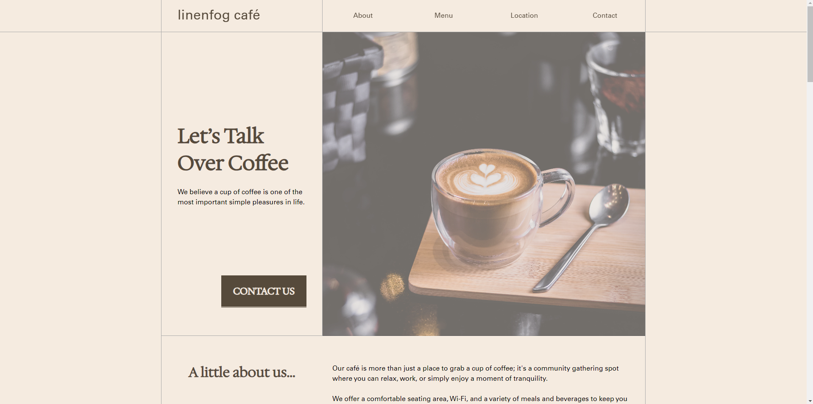
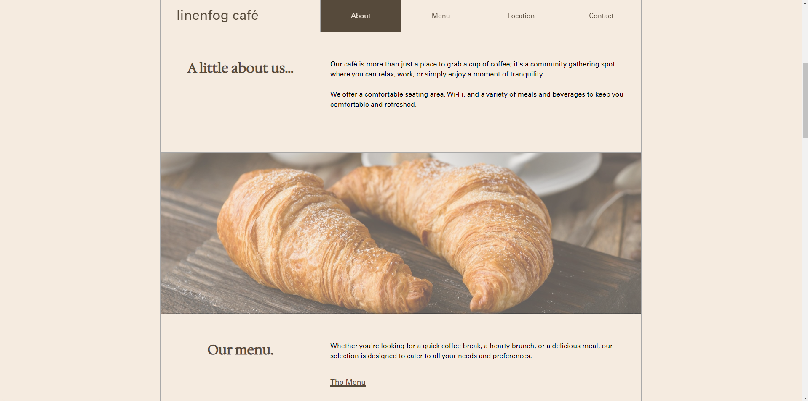
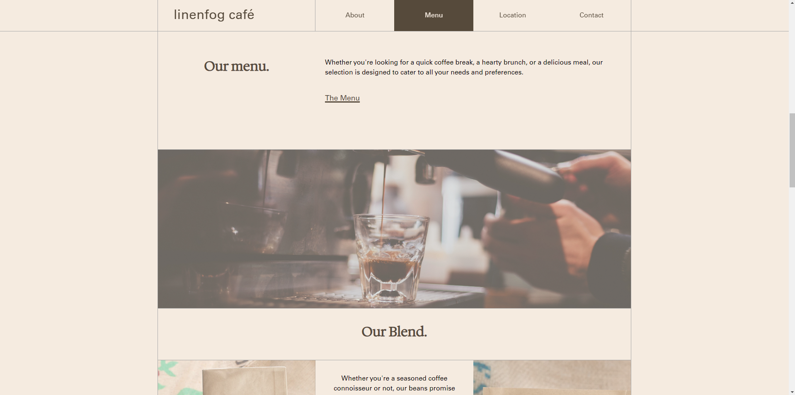
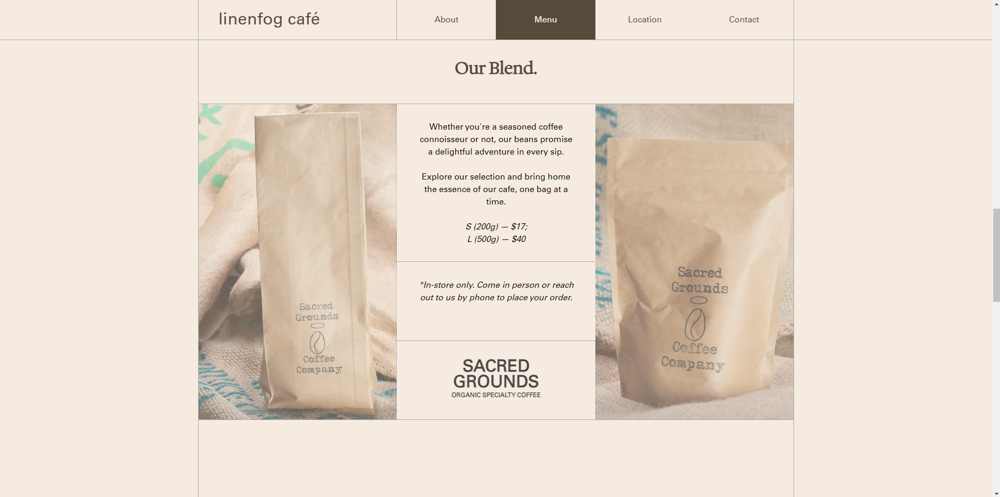
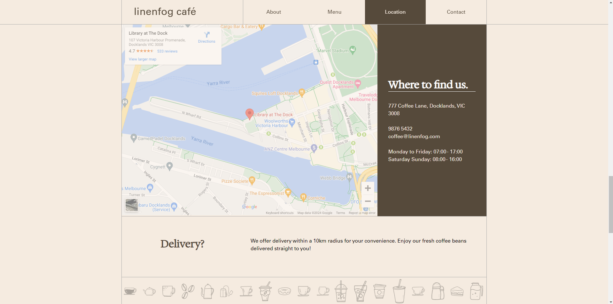
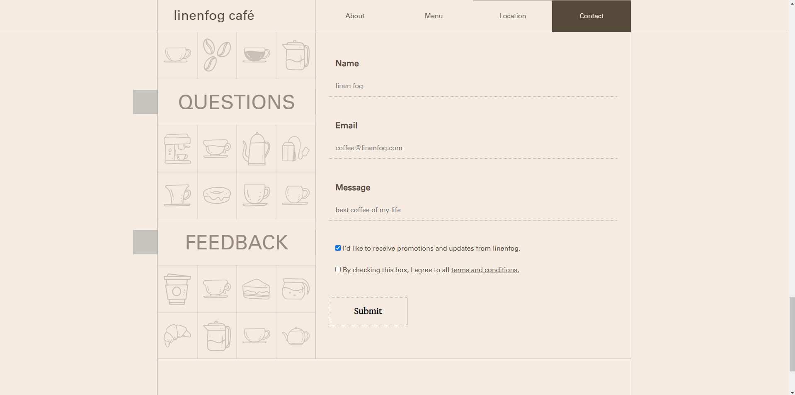
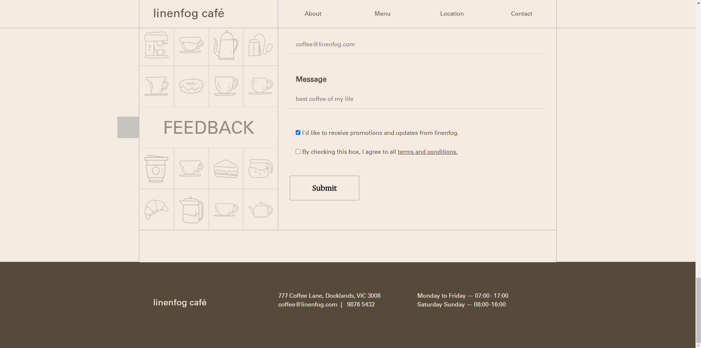

#### Mobile Interface

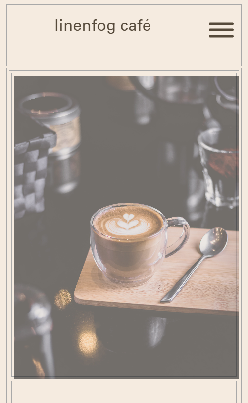
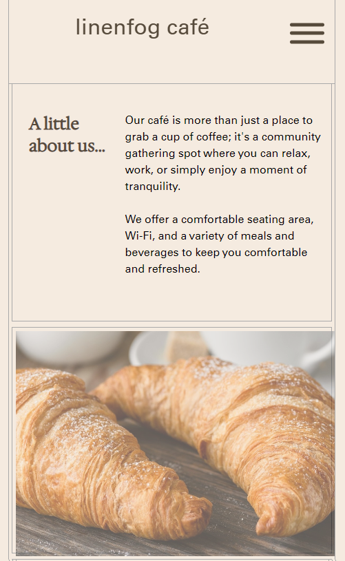
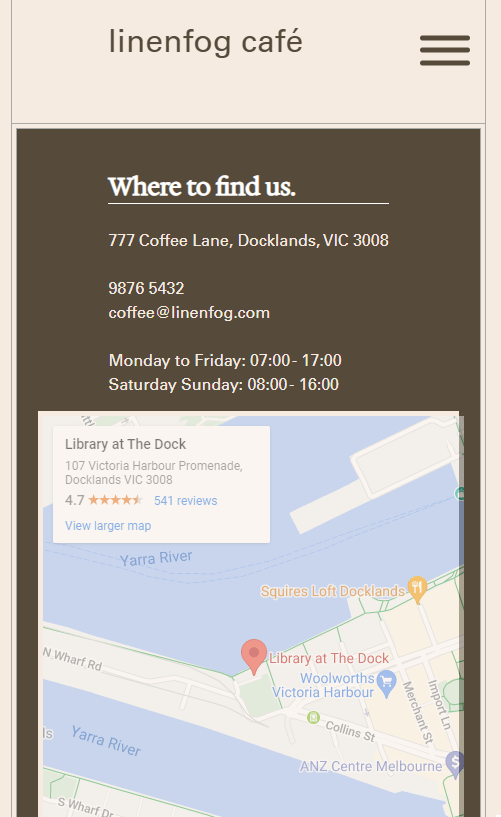
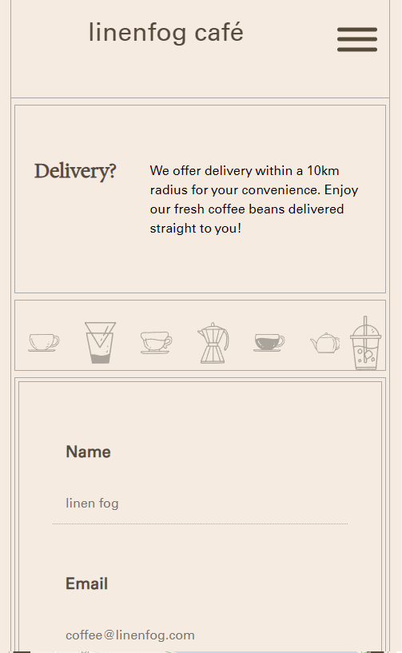
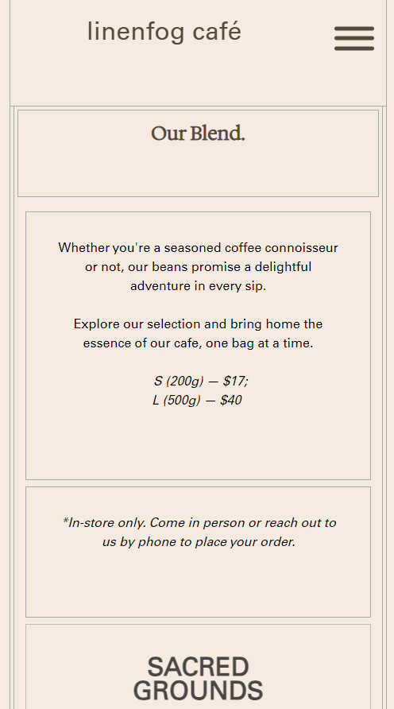
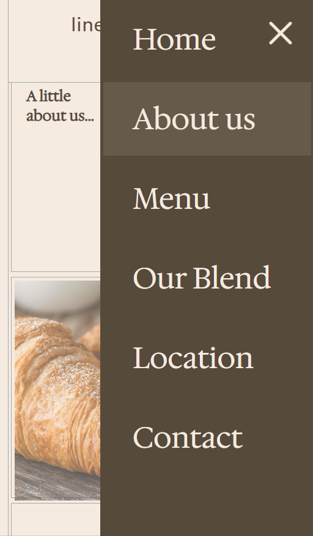

### Roadmap

-   Code clean up & optimisation
-   Intersection observer animations
-   React refactoring
-   Night mode
